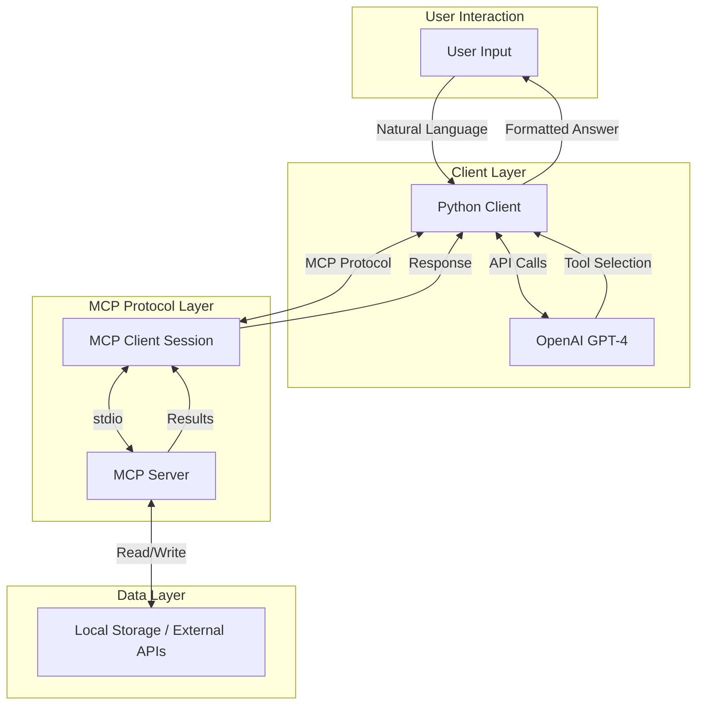

# MCP Experiments - Personal Assistant & Data Dashboard

Two production-ready experiments demonstrating the **Model Context Protocol (MCP)** with both CLI and web interfaces.

🔗 **[Live Demo](https://your-app.vercel.app)**

## What is MCP?

**Model Context Protocol (MCP)** is an open standard that enables seamless integration between AI applications and external data sources or tools. Think of it as a universal "translator" that allows AI assistants to:

- Access external data (databases, APIs, files)
- Execute specific actions (save notes, fetch weather, run commands)
- Maintain context across interactions
- Use structured tool calling instead of brittle prompt engineering

### Why MCP?

Traditional AI integrations require custom code for each data source. MCP provides:
- **Standardized communication** - One protocol for all integrations
- **Tool discovery** - AI can discover available tools dynamically
- **Type safety** - Structured schemas for inputs and outputs
- **Composability** - Mix and match different MCP servers

## Project Overview

This repository contains two independent experiments:

### Experiment 1: Personal Assistant Memory Server
An AI assistant that can remember and search your personal notes using simple CRUD operations.

**Use Case:** "Remember that my project deadline is September 30" → AI saves note → Later: "When is my project deadline?" → AI searches and retrieves it

### Experiment 2: Data Dashboard Connector
An AI assistant that fetches real-time weather data from external APIs and presents it conversationally.

**Use Case:** "What's the weather in Tokyo?" → AI calls weather API → Returns formatted weather information

## Architecture Overview



## Project Structure

```
MCP-Experiments/
│
├── experiment-1-personal-assistant/
│   ├── api/                # Vercel serverless functions
│   │   ├── save_note.py
│   │   └── search_notes.py
│   ├── server.py           # MCP server (CLI mode)
│   ├── client.py           # CLI client
│   ├── index.html          # Web UI
│   ├── notes.json          # Note storage
│   └── requirements.txt
│
├── experiment-2-data-dashboard/
│   ├── api/                # Vercel serverless functions
│   │   └── weather.py
│   ├── server.py           # MCP server (CLI mode)
│   ├── client.py           # CLI client
│   ├── index.html          # Web UI
│   └── requirements.txt
│
├── index.html              # Landing page
├── vercel.json             # Vercel deployment config
├── .env.example
├── .gitignore
└── README.md
```

## Features

✅ **Dual Mode**: CLI and Web interfaces
✅ **Production Ready**: Deployable to Vercel
✅ **No Database Required**: Simple JSON storage
✅ **Free Weather API**: No API key needed for weather
✅ **Modern UI**: Clean, responsive design

## Quick Start (Web Interface)

### Option 1: Deploy to Vercel (Recommended)

[](https://vercel.com/new/clone?repository-url=https://github.com/YOUR_USERNAME/MCP-Experiments)

1. Click the button above
2. Connect your GitHub account
3. Deploy automatically
4. Access your live app!

### Option 2: Local Development

```bash
# Clone the repository
git clone https://github.com/YOUR_USERNAME/MCP-Experiments.git
cd MCP-Experiments

# Open index.html in your browser
# Or use a simple server:
python -m http.server 8000
# Visit http://localhost:8000
```

## CLI Mode Setup

For running the CLI version with OpenAI integration:

### Prerequisites

- **Python 3.10+**
- **OpenAI API Key** - Get one at https://platform.openai.com/api-keys

### Installation

### 1. Clone the Repository

```bash
git clone <your-repo-url>
cd MCP-Experiments
```

### 2. Set Up Environment Variables

Create a `.env` file in the project root:

```bash
# Copy the example file
cp .env.example .env

# Edit .env and add your OpenAI API key
OPENAI_API_KEY=sk-your-actual-key-here
```

### 3. Install Dependencies

Choose one experiment to start with:

**For Experiment 1:**
```bash
cd experiment-1-personal-assistant
pip install -r requirements.txt
```

**For Experiment 2:**
```bash
cd experiment-2-data-dashboard
pip install -r requirements.txt
```

Or install both at once:
```bash
pip install -r experiment-1-personal-assistant/requirements.txt
pip install -r experiment-2-data-dashboard/requirements.txt
```

## Usage

### Web Interface

1. **Experiment 1 - Personal Assistant**
   - Navigate to `/experiment-1-personal-assistant/`
   - Add notes with tags
   - Search your saved notes
   - All data stored locally

2. **Experiment 2 - Weather Dashboard**
   - Navigate to `/experiment-2-data-dashboard/`
   - Enter any city name
   - View real-time weather data
   - Beautiful visualizations

### CLI Mode (requires OpenAI API key)

**Experiment 1:**
```bash
cd experiment-1-personal-assistant
python client.py
```

**Experiment 2:**
```bash
cd experiment-2-data-dashboard
python client.py
```

## How Each Experiment Works

### Experiment 1 Flow

1. **User input** → "Remember my meeting is tomorrow"
2. **Client** → Sends to OpenAI GPT-4 with available tool definitions
3. **GPT-4** → Analyzes input, decides to use `save_note` tool
4. **Client** → Calls MCP server's `save_note` tool
5. **Server** → Saves note to `notes.json` file
6. **Server** → Returns success confirmation
7. **GPT-4** → Receives result, generates natural response
8. **Client** → Displays: "I've saved your meeting for tomorrow"

### Experiment 2 Flow

1. **User input** → "What's the weather in Tokyo?"
2. **Client** → Sends to OpenAI GPT-4 (displays: "[LLM] Determining required tool...")
3. **GPT-4** → Decides to use `get_current_weather("Tokyo")`
4. **Client** → Calls MCP server (displays: "[LLM] Calling MCP tool: get_current_weather")
5. **Server** → Fetches weather from wttr.in API (displays: "[MCP] Fetching weather for Tokyo...")
6. **Server** → Returns formatted weather data
7. **GPT-4** → Generates natural language response
8. **Client** → Displays weather information conversationally

## Key Features

### Experiment 1
- ✅ Save notes with tags
- ✅ Search notes by content or tags
- ✅ Simple case-insensitive search
- ✅ Persistent storage in JSON
- ✅ Get/delete individual notes

### Experiment 2
- ✅ Real-time weather data
- ✅ No API key required for weather
- ✅ Visible MCP call flow
- ✅ Error handling for invalid locations
- ✅ Global weather coverage

## Technologies Used

| Component | Technology | Purpose |
|-----------|-----------|---------|
| **MCP Framework** | Python MCP SDK | Standard protocol for AI-tool communication |
| **AI Model** | OpenAI GPT-4 Mini | Natural language understanding & function calling |
| **Communication** | stdio (stdin/stdout) | Process communication between client and server |
| **Storage (Exp 1)** | JSON file | Simple persistent note storage |
| **Weather API (Exp 2)** | wttr.in | Free weather data (no auth required) |
| **Async I/O** | Python asyncio | Non-blocking MCP communication |

## Deployment to Vercel

### Step 1: Push to GitHub

```bash
git init
git add .
git commit -m "Initial commit"
git remote add origin https://github.com/YOUR_USERNAME/MCP-Experiments.git
git push -u origin master
```

### Step 2: Deploy to Vercel

1. Go to [vercel.com](https://vercel.com)
2. Click "New Project"
3. Import your GitHub repository
4. Click "Deploy"
5. Done! Your app is live

### Custom Domain (Optional)

1. Go to your project settings in Vercel
2. Navigate to "Domains"
3. Add your custom domain
4. Update DNS records as instructed

## Troubleshooting

### Web Interface Issues
- **Notes not saving**: Check browser console for errors
- **Weather not loading**: Verify internet connection
- **API errors**: wttr.in may be temporarily unavailable

### CLI Mode Issues
- **"No module named 'mcp'"**: Run `pip install mcp openai python-dotenv`
- **"OpenAI API key not found"**: Create `.env` file with your API key
- **Server errors**: Ensure you're running `client.py`, not `server.py` directly

## What You Learned

1. **MCP Protocol basics** - How clients and servers communicate
2. **Tool calling pattern** - How LLMs decide which tools to use
3. **Async programming** - Using Python's asyncio for I/O
4. **API integration** - Connecting external data sources to AI
5. **Function calling** - OpenAI's structured tool execution

## Next Steps

- Add more note features (edit, list all, filter by date)
- Add more weather tools (forecast, multiple cities)
- Implement other MCP servers (calendar, email, database)
- Build a web UI instead of terminal interface
- Explore other MCP SDKs (TypeScript, Go)

## License

This project is for educational purposes. Feel free to use and modify as needed.

## Resources

- [MCP Documentation](https://modelcontextprotocol.io/)
- [OpenAI Function Calling](https://platform.openai.com/docs/guides/function-calling)
- [wttr.in API](https://github.com/chubin/wttr.in)

---

Built as a beginner-friendly introduction to the Model Context Protocol 🚀
