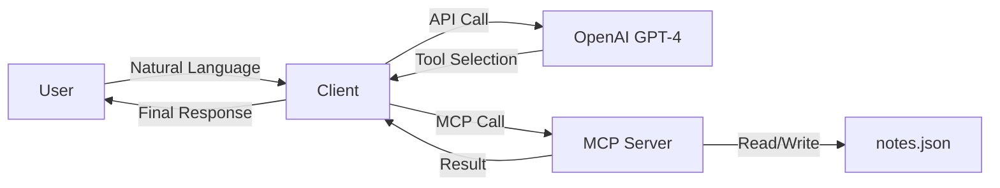

# Experiment 1: Personal Assistant Memory Server

A simple MCP (Model Context Protocol) server that provides tools for storing and searching personal notes. This demonstrates how an AI assistant can maintain memory through structured tool calls.

## Overview

This experiment implements:
- **MCP Server** (`server.py`): Provides tools for CRUD operations on notes
- **Client** (`client.py`): Natural language interface using OpenAI's GPT-4 with function calling

## Architecture



## Available Tools

1. **save_note** - Save a new note with content and tags
2. **search_notes** - Search notes by query (searches content and tags)
3. **get_note** - Retrieve a specific note by ID
4. **delete_note** - Delete a note by ID

## Setup

1. Install dependencies:
```bash
pip install -r requirements.txt
```

2. Set up environment variables:
```bash
# Create .env file in project root
OPENAI_API_KEY=your_openai_api_key_here
```

## Running the Experiment

1. Start the client (it automatically connects to the server):
```bash
python client.py
```

## Example Usage

```
You: Remember that my project deadline is September 30
Assistant: I've saved that note about your project deadline being September 30.

You: What did I say about the project deadline?
[Calling tool: search_notes]
Assistant: You mentioned that your project deadline is September 30.

You: Remember my meeting with Sarah is on October 5 at 2pm
Assistant: Got it! I've saved your meeting with Sarah on October 5 at 2pm.

You: When is my meeting with Sarah?
[Calling tool: search_notes]
Assistant: Your meeting with Sarah is scheduled for October 5 at 2pm.
```

## How It Works

1. User enters a natural language query
2. Client sends query to OpenAI GPT-4
3. GPT-4 determines if it needs to call any tools (save_note, search_notes, etc.)
4. Client executes the selected MCP tool on the server
5. Server performs the operation (read/write to notes.json)
6. Result is sent back to GPT-4
7. GPT-4 generates a natural language response
8. Client displays the response to the user

## Data Storage

Notes are stored in `notes.json` with the following structure:
```json
[
  {
    "id": 1,
    "content": "Project deadline is September 30",
    "tags": ["project", "deadline"],
    "timestamp": "2024-09-24T10:30:00"
  }
]
```

## Technologies Used

- **MCP SDK** - Model Context Protocol for tool communication
- **OpenAI API** - GPT-4 for natural language understanding and function calling
- **Python asyncio** - Asynchronous I/O for MCP communication
- **JSON** - Simple file-based storage
