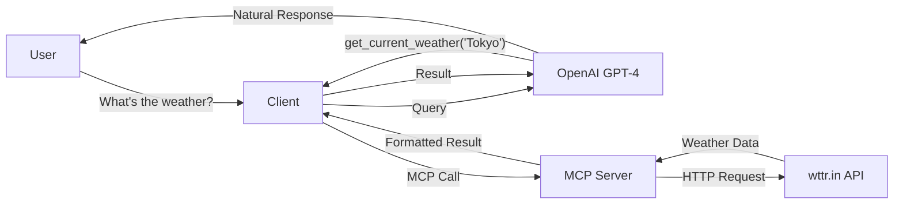

# Experiment 2: Data Dashboard Connector

A simple MCP (Model Context Protocol) server that provides real-time weather information. This demonstrates how an AI assistant can retrieve external data through API calls and present it conversationally.

## Overview

This experiment implements:
- **MCP Server** (`server.py`): Provides a tool to fetch current weather data
- **Client** (`client.py`): Natural language interface with visible MCP flow

## Architecture



## Available Tools

1. **get_current_weather** - Get current weather for any location
   - Parameter: `location` (city or location name)
   - Returns: Temperature, condition, humidity, wind speed, feels like

## Setup

1. Install dependencies:
```bash
pip install -r requirements.txt
```

2. Set up environment variables:
```bash
# Create .env file in project root
OPENAI_API_KEY=your_openai_api_key_here
```

## Running the Experiment

1. Start the client (it automatically connects to the server):
```bash
python client.py
```

## Example Usage

```
You: What's the weather in Tokyo?
[LLM] Determining required tool...
[LLM] Calling MCP tool: get_current_weather
[MCP] Fetching weather for Tokyo...
[MCP] Tool result received.
[LLM] Generating final response...

Assistant: The current weather in Tokyo is 24°C and partly cloudy, with 70% humidity and winds around 12 km/h.

You: How's the weather in London?
[LLM] Determining required tool...
[LLM] Calling MCP tool: get_current_weather
[MCP] Fetching weather for London...
[MCP] Tool result received.
[LLM] Generating final response...
Assistant: London is currently 15°C with cloudy conditions...
```

## How It Works

1. User asks a weather question
2. Client sends the query to OpenAI GPT-4
3. GPT-4 determines it needs weather data and calls `get_current_weather`
4. Client executes the MCP tool on the server
5. Server makes an HTTP request to wttr.in API
6. API returns weather data
7. Server formats and returns the result
8. GPT-4 receives the data and generates a natural language response
9. Client displays the conversation flow and final response

## Weather Data Source

This experiment uses **wttr.in**, a free weather API that requires no authentication:
- No API key needed
- Simple HTTP requests
- Returns comprehensive weather data
- Global coverage

## Technologies Used

- **MCP SDK** - Model Context Protocol for tool communication
- **OpenAI API** - GPT-4 for natural language understanding and function calling
- **wttr.in API** - Free weather data service
- **Python asyncio** - Asynchronous I/O for MCP communication
- **urllib** - Built-in HTTP client (no external dependencies)
